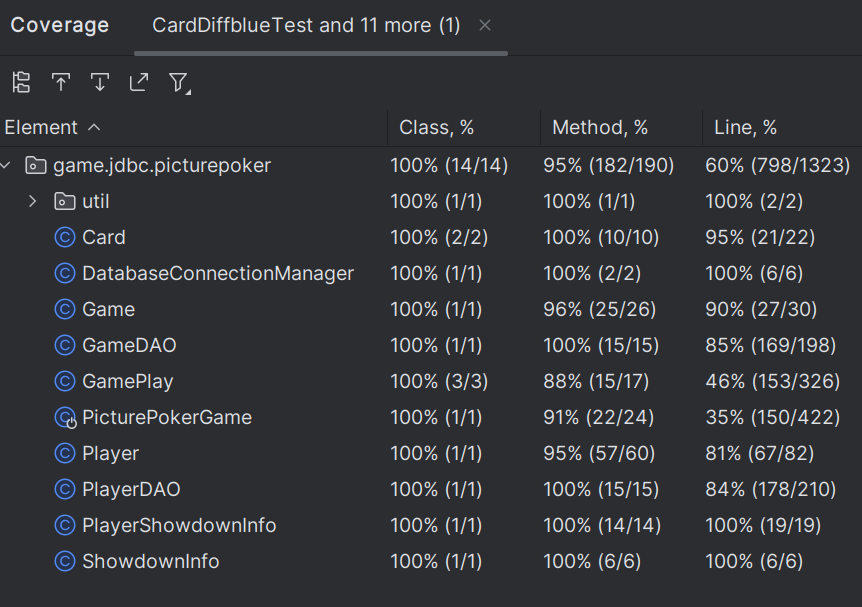

**LUIGI'S PICTURE POKER - FOR ECE-366**

A game where anybody and everybody can be scammed by Luigi. Multiplayer, so you can see who is the worst or the best at getting scammed by Luigi. 

In this multiplayer version of Picture Poker, players can bet "money" on games and try to accumulate as many tokens as possible by creating strong hands to beat Luigi. The players with the most tokens will receive larger portions of the pot. During each round, players can bet up to five tokens and may select and redraw any and all of the five cards in their hands in an attempt to improve their hand. After each player has bet and redrawn, Luigi selects cards from his hands to redraw using a semi-intelligent algorithm, then each player compares their hand to Luigi's to see if they win big or lose their bet.

This version of Picture Poker also features profiles for players, tracking how you've placed in games and how many tokens you've accumulated over the course of play.

**TO RUN LOCALLY**

Once all files are downloaded, navigate into the directory, and do 

```shell
docker compose build
docker compose up
```

to build the file. If the database has not been set up yet, the commands above should automatically set up the database. 
To manually set up the database, you may run the Python script below which runs the necessary SQL commands to 
reset the database, or you may manually delete the database and try running the commands above again. 
```shell
Database\ SQL/databaseCreation.py
```

**Testing**

Note that as seen in the report, we have achieved the mandatory test coverage - 50% of the lines have been covered by 
tests, which is enough for our purposes. 


We also included an HTML file in the `/src/test/java/game/jdbc/picturepoker/testHTML` folder, if one wishes to see the testing in further detail. 


**Ethics: How did we follow them?**

1. This program acts in the public interest - Creating an account is free, as we hope that everybody will be able to experience Luigi Poker without cost towards themselves, and playing does not cost anything to any players.  

2. This program is in favor of the product - We have tried to make the best variant of Luigi Poker possible, with a lot of concentration in the UI to create a polished final product.  

3. This program does not harm the environment – use of this program is not intended to cause issues with the environment, and any use of it to harm the environment is not our intention.  

4. This program supports colleagues – everybody in this project worked together to accomplish what we have done, and we all learned more about React, Java, and SQL through creating this program and through each other.  

5. We avoid deception in all statements. This program does exactly what it says it will do, and everything the player expects.  

6. Goals were all achievable – we strived for and met the goal of having a fully playable Luigi Poker game which lets friends join in. Some stretch goals were not met, but this is why they were stretch goals.  

7. Software we worked on was fully specified – Springboot, Docker, and such is well documented software, and the end result is also well specified on how it is to be run.  

8. Documentation was well done – we used GitHub throughout the project, and all progress has been tracked via GitHub.  

9. We do not engage in bribery. This project was done under our own power and did not involve any underhanded methodology.  

10. This program promotes other software engineers – techniques used throughout this program were discussed with other students in the class, which allowed them to apply techniques to their own code, and various techniques in our code was made possible only by discussion with others.  

11. This project furthered everybody’s knowledge in Postgres, Java, and React, which ultimately 
is the end goal of the project.  